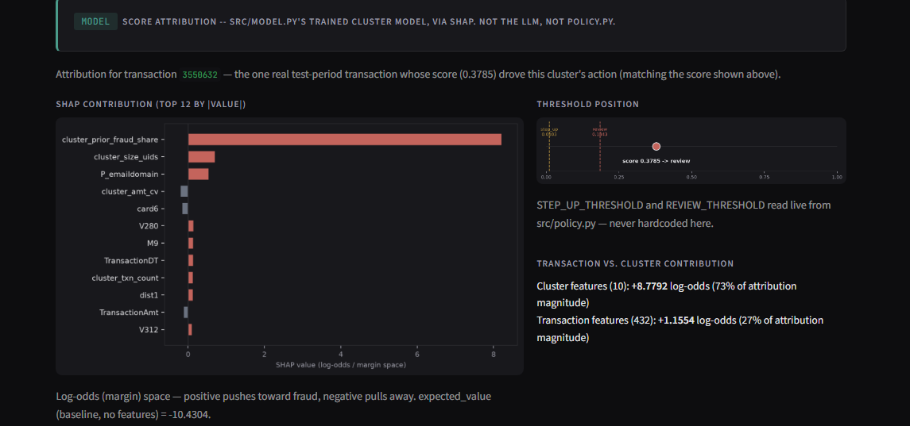
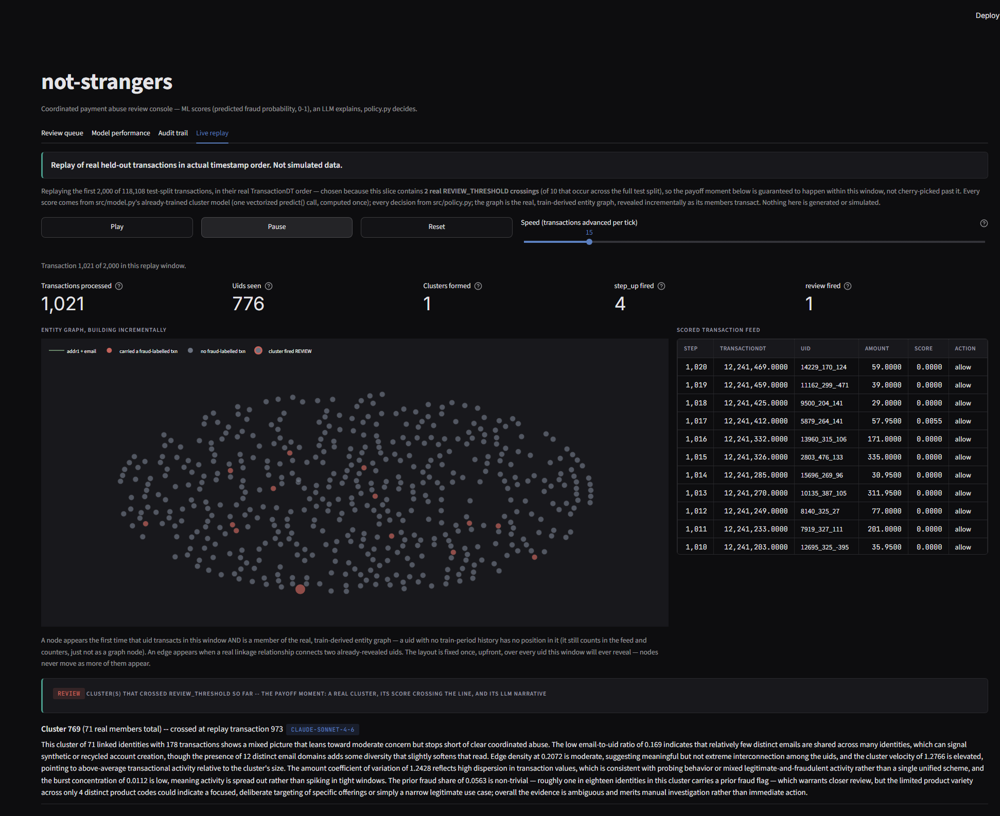
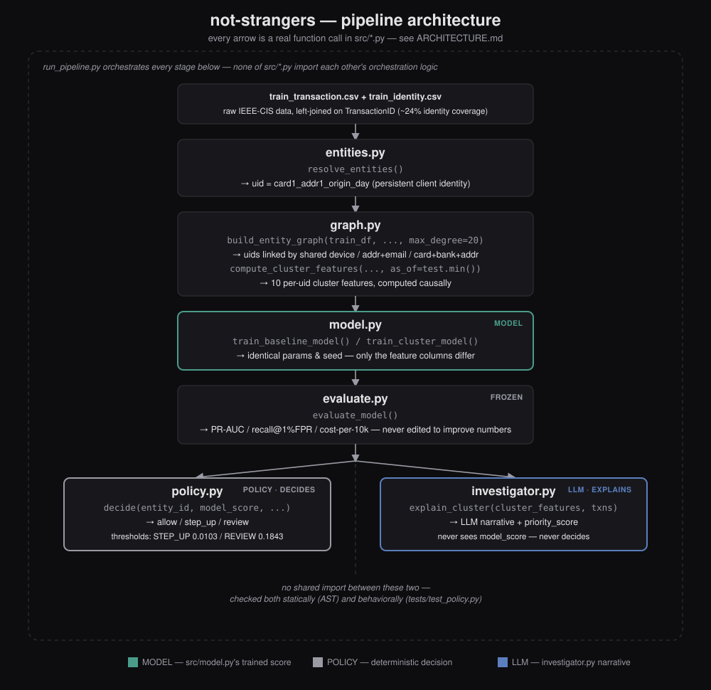

# not-strangers

Detects coordinated payment abuse by resolving IEEE-CIS transactions into
persistent client identities and scoring the *clusters* those identities
form (shared device, address+email, or card/bank/address), instead of
scoring each transaction in isolation.

## Result

| Model | PR-AUC | Recall @ 1% FPR | Cost per 10k txns |
|---|---|---|---|
| Baseline (txn features only) | 0.5646 | 0.4791 | 30,078.40 |
| + cluster features | 0.6322 | 0.5576 | 26,155.72 |
| + cluster features, minus `cluster_prior_fraud_share` | 0.5756 | 0.4951 | 29,317.66 |

The cluster model lifts PR-AUC by +0.0676 over the transaction-only
baseline (0.6322 vs. 0.5646). About 84% of that lift comes from a single
feature, `cluster_prior_fraud_share` -- without it, +0.0110. Across 4
rolling temporal splits the full lift holds directionally (mean +0.0516)
but the residual after removing that feature does not (mean +0.0060,
sign flips across splits). Full analysis, sanity checks and the
cross-split breakdown: [results/ablation.md](results/ablation.md),
[results/stability.md](results/stability.md).


## The console

A cluster of three uids, every one linked to every other. One carried a
fraud-labelled transaction. The edge colour shows which linkage rule
connected them -- here, shared `addr1` + email domain.


Below the graph, the model's own reasoning: SHAP contributions in
log-odds space, and the split between transaction-level and
cluster-level features. For this cluster, 73% of the attribution
magnitude comes from cluster features -- the project's core claim, made
visible per decision. The LLM narrative sits beneath it, labelled with
its source, and never touches the decision.



The review queue ranks clusters by `investigator.py`'s priority score.
The action column is `policy.py`'s real decision -- score against a
fixed threshold -- which is a separate thing from the ranking, and the
two can disagree. Cluster 121987 has 50 uids and gets `allow`; cluster
74986 has 3 and gets `review`. That is the priority score being
dominated by `cluster_prior_fraud_share`: a large group with no fraud
history ranks below a small one that has it. See
[results/queue_eval.md](results/queue_eval.md).


Live replay runs real held-out transactions through the pipeline in
their actual timestamp order, building the entity graph as uids
transact. Not simulated data.



## Queue-level evaluation

At K=50, the priority ranking's precision@k is 0.0600 (3.3x the 1.8%
base rate) vs. 0.1000 (5.5x) for a naive mean-score baseline -- the
priority ranking is behind or tied at all 4 K values tested. With only 9
fraud-containing clusters in the qualifying population, that gap is
within the noise this sample size can produce. Full breakdown --
precision@k, recall@k, lift over base rate, the noise caveat -- is in
[results/queue_eval.md](results/queue_eval.md).

## Reproduce

```
python -m src.run_pipeline
```

or `make results` if you have GNU Make (not installed by default on
Windows; see DEVLOG.md). Both produce every artifact in `results/` end
to end, except `results/case_studies.md` (hand-curated, see
`scripts/case_studies.py`).

Run the dashboard: `streamlit run app.py`

## Setup

1. **Python environment**
```
   python -m venv .venv
   .venv/Scripts/activate   # or .venv/bin/activate on macOS/Linux
   pip install -r requirements.txt
```
2. **Data** -- `bash scripts/download_data.sh` (needs a Kaggle account and
   the `kaggle` CLI). Never committed to `data/`.
3. **LLM layer (optional)** -- set `ANTHROPIC_API_KEY` for real
   explanations from `claude-sonnet-4-6`; everything works without it via
   a deterministic fallback. Using a workspace-scoped key? See
   Troubleshooting below.

## Architecture



```
entities.py  --  resolve_entities()  ->  uid (persistent client identity)
      |
graph.py     --  build_entity_graph() + compute_cluster_features(), causally
      |
model.py     --  baseline vs. cluster-augmented LightGBM, identical hyperparameters
      |
evaluate.py  --  PR-AUC / recall@1%FPR / cost-per-10k (frozen; never edited to improve numbers)
      |
policy.py    --  allow / step_up / review, from fixed cost-derived thresholds
      |
investigator.py  --  LLM narrative + priority score for the review queue
```

**The ML/LLM/policy separation is structural, not a convention** --
`policy.py` has no import of `investigator.py` (checked both statically
and behaviorally), and its `decide()` action comes only from a model
score against two fixed, cost-derived thresholds, never from
`investigator.py`'s narrative or priority score. The dashboard carries
this separation into the UI, labeling every decision with the policy
threshold that produced it and every narrative with its real source.
Full detail -- the AST/behavioral checks, threshold provenance, linkage
rules, and the batch/inline split -- is in
[ARCHITECTURE.md](ARCHITECTURE.md).

## Limitations

- **The dominant feature is backward-looking, partly circular fraud
  history -- and richer topology features don't change that.**
  `cluster_prior_fraud_share` measures label propagation across a card,
  not independently-discovered abuse, and carries essentially all of the
  reliably measured lift; a second attempt with topology features
  (k-core depth, hub-vs-clique shape) still didn't produce a stable
  effect across splits, which is a finding about this dataset and sample
  size, not a bug. Full discussion:
  [results/ablation.md](results/ablation.md),
  [results/stability_topology.md](results/stability_topology.md).
- **The uid over-merges.** `card1_addr1_origin_day` is highly label-pure
  (98.53%) but not verified-correct -- 10 of the 20 largest uids mix
  multiple distinct clients on `P_emaildomain`. Full collision check:
  [results/d1_investigation.md](results/d1_investigation.md).
- **~11% of rows get no uid at all, and that's the highest-risk slice.**
  11.63% fraud rate among NaN-uid rows vs. 2.46% among uid'd rows -- they
  stay in training with null cluster features rather than being dropped.
  Full breakdown: [results/uid_validation.md](results/uid_validation.md).
- **`max_degree=20` trades a few large rings for avoiding a supercluster
  collapse.** The function's own default (1000) collapses 64% of all
  uids into one component; 20 keeps the largest cluster at 0.06%. Full
  sweep and rationale: [ARCHITECTURE.md](ARCHITECTURE.md).
- **Calibration is overconfident exactly where the policy operates.**
  The highest-score bin predicts ~0.48 but the actual positive rate is
  ~0.35 -- `REVIEW_THRESHOLD` should be read as an arbitrary cut, not a
  probability estimate. Full reliability curve:
  [results/ablation.md](results/ablation.md)'s Calibration section.
- **Clusters have no ground truth.** There is no "real ring" label
  anywhere in this dataset -- everything reported is feature lift, not
  ring-detection accuracy. Qualitative inspection, including one case
  flagged as ambiguous: [results/case_studies.md](results/case_studies.md).
- **The groundedness result is one run of 30 clusters.** 100% (0 of 182
  claims) is real but not a permanent guarantee -- it should keep being
  measured on every future run. Full run:
  [results/investigator_eval.md](results/investigator_eval.md).

## Mapping to production

This project's features are IEEE-CIS's own card-network columns, not
Razorpay's -- the closest analogues in a real Indian payments stack:
`card1` to a tokenized payment instrument, `DeviceInfo` to a client-SDK
device fingerprint, `addr1` to a pincode/region code, `P_emaildomain` to
a customer contact identity, with no equivalent here for a VPA handle,
the UPI PSP, a cash-on-delivery flag, merchant category, or a shipping
address distinct from billing. UPI also has no chargeback mechanism, so
this project's label source (chargeback-reported, propagating across a
card) doesn't carry over -- the nearest substitutes, merchant-reported
fraud and RTO/return-abuse signals, come from a different actor on a
different timeline and would need their own label-latency and
label-noise measurement.

## Troubleshooting

**Investigator narratives are all falling back to the template, even
with `ANTHROPIC_API_KEY` set.** Check
`results/investigator_eval.md`'s "Fallback errors encountered" section
for the actual exception. The most common cause: an identity-linked
(workspace-scoped) key also needs `ANTHROPIC_WORKSPACE_ID` set -- the
API rejects every call from such a key without an
`anthropic-workspace-id` header, and before this was fixed that failure
was completely silent: all 30 of 30 explanations fell back, while the
report itself claimed at least one had used the real LLM path. Full
incident writeup: DEVLOG.md.
