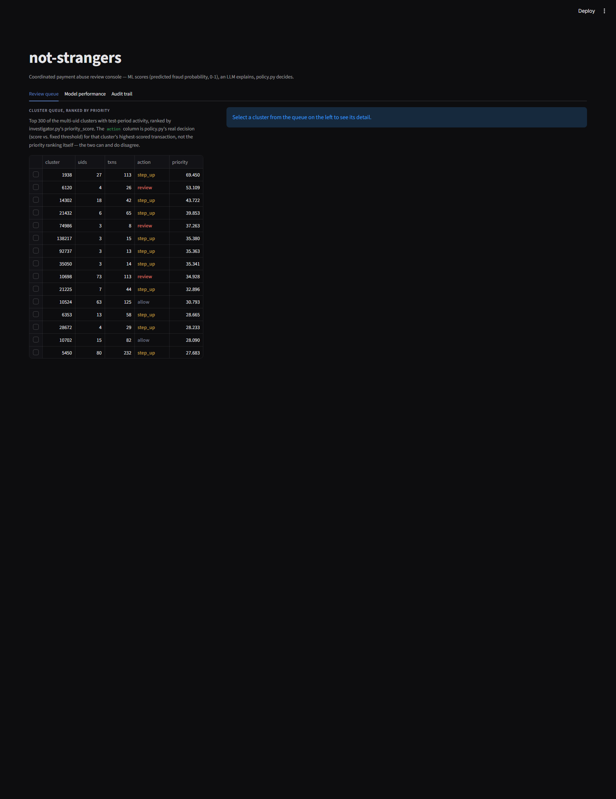
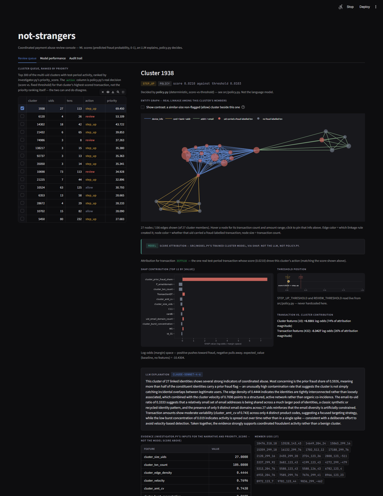
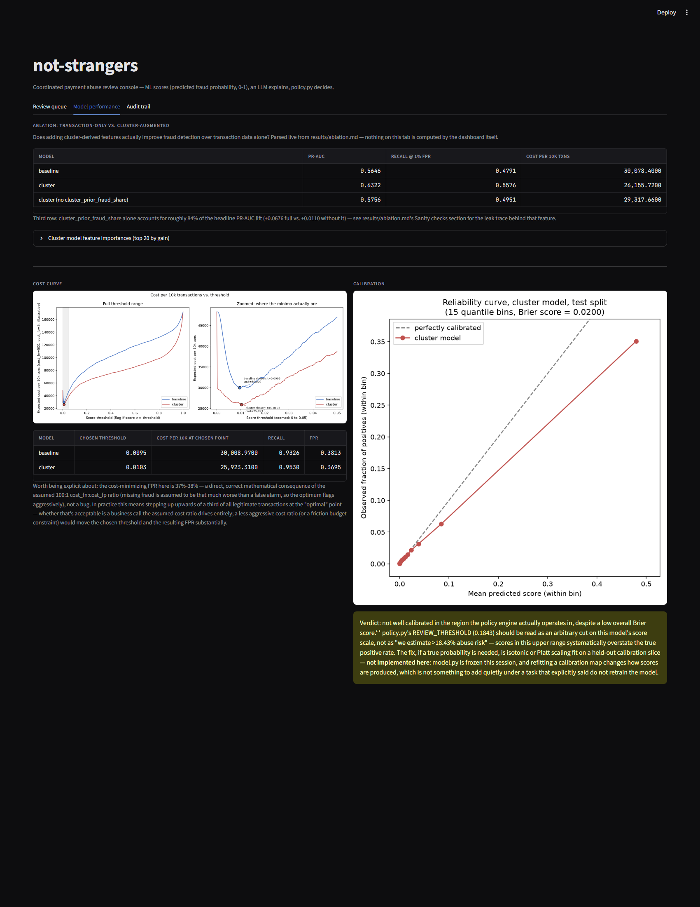

# abuse-ring-sentinel

Detects coordinated payment abuse by resolving IEEE-CIS transactions into
persistent client identities and scoring the *clusters* those identities
form (shared device, address+email, or card/bank/address), instead of
scoring each transaction in isolation.

## Result

| Model | PR-AUC | Recall @ 1% FPR | Cost per 10k txns |
|---|---|---|---|
| Baseline (txn features only) | 0.5646 | 0.4791 | 30,078.40 |
| + cluster features | 0.6322 | 0.5576 | 26,155.72 |
| + cluster features, minus `cluster_prior_fraud_share` | 0.5756 | 0.4951 | 29,317.66 |

Temporal holdout (472,432 train / 118,108 test rows, split on
`TransactionDT`, never random). Full breakdown, hyperparameters, feature
importances, adversarial sanity checks, the threshold/cost curve and
calibration are in [results/ablation.md](results/ablation.md).

**Read the third row before the first one.** About 84% of the headline
PR-AUC lift (+0.0676) comes from a single feature,
`cluster_prior_fraud_share` -- without it, the lift is +0.0110 PR-AUC
(0.5756 vs. 0.5646) on this split. That feature was traced end to end and
confirmed not to leak test-period labels (checked against all 155,579
clusters, not spot-checked -- see results/ablation.md's Sanity checks
section), but its predictive power leans heavily on this dataset's
label-propagation dynamic (a chargeback on one transaction retroactively
marks the rest of that card's history as fraud), not on an
independently-discovered abuse signal. See Limitations below.

**The +0.0676 figure above is a single split; it should never be read
alone.** Re-running the full ablation at 4 rolling temporal splits
(60/70/80/90% through sorted `TransactionDT` -- see
[results/stability.md](results/stability.md)) gives: full lift **mean
+0.0516 across the 4 splits, spread 0.0393** -- directionally consistent
(positive at every split) and larger than the single 0.68-point figure by
itself would suggest is stable, but with real swing. **Correction, not a
softening:** this project previously described the residual lift once
`cluster_prior_fraud_share` is removed as "a smaller but genuine residual
lift" from the remaining structural/graph features (edge density,
velocity, burst concentration, email heterogeneity, cluster size). That
claim does not hold up. Across the same 4 splits, the residual lift is
**mean +0.0060, spread 0.0230, and changes sign** (negative at 60% and
90%, positive at 70% and 80%). Graph-structure features alone do not show
a reliable lift on this dataset at this sample size -- only
`cluster_prior_fraud_share` shows a consistently positive effect across
splits, and per the Limitations note below, that effect is itself partly
circular. Full per-split numbers are in
[results/stability.md](results/stability.md).

## Queue-level evaluation

Base rate: 1.8% of qualifying test-split multi-uid clusters contain at least one fraud transaction (9 of 494). Both rankings land far above that: at K=50, precision@k is 0.0600 (3.3x base rate) for the system's priority ranking vs. 0.1000 (5.5x) for a naive mean-score baseline with no cluster features at all -- the priority ranking is behind or tied at 4 of 4 K values tested, but with only 9 fraud-containing clusters in the whole population, that gap is mostly within the noise this sample size can produce (4 of 4 K values show a difference of 3 clusters or fewer). Full breakdown -- precision@k, recall@k, lift over base rate, and the noise caveat -- is in [results/queue_eval.md](results/queue_eval.md).

## Reproduce

```
python -m src.run_pipeline
```

or, if you have GNU Make available (it is **not** present by default on
Windows -- this was checked, not assumed; see DEVLOG.md):

```
make results
```

Both run the identical pipeline and produce every artifact in `results/`
end to end: the ablation table, sanity checks, cost curve, calibration
plot, investigator evaluation, audit trail sample, and the performance
benchmark appended to ARCHITECTURE.md. `results/case_studies.md` is the
one exception -- it's a hand-curated qualitative write-up, not
regenerated automatically (see `scripts/case_studies.py`'s docstring).

Run the dashboard with:

```
streamlit run app.py
```

## Setup

1. **Python environment**
   ```
   python -m venv .venv
   .venv/Scripts/activate   # or .venv/bin/activate on macOS/Linux
   pip install -r requirements.txt
   ```
2. **Data.** Run `bash scripts/download_data.sh` (needs a Kaggle account,
   the `kaggle` CLI, and having accepted the IEEE-CIS Fraud Detection
   competition rules). This project never commits anything under `data/`.
3. **LLM layer (optional).** `investigator.py` degrades gracefully with no
   key at all -- `make results` and the dashboard both work either way,
   falling back to a deterministic template narrative.
   - `ANTHROPIC_API_KEY` -- enables real explanations from
     `claude-sonnet-4-6`.
   - `ANTHROPIC_WORKSPACE_ID` -- **required in addition to the key if
     your key is identity-linked** (a workspace-scoped key). Identity-linked
     keys are rejected by the API on every call without an
     `anthropic-workspace-id` header, and (before this was fixed) that
     failure was silent -- see DEVLOG.md's entry on this for the full
     story, and `results/investigator_eval.md`'s "Fallback errors
     encountered" section to check whether calls are actually succeeding
     in your environment.

## Architecture

```
entities.py  --  resolve_entities()  ->  uid (persistent client identity)
      |
graph.py     --  build_entity_graph() + compute_cluster_features(), causally
      |
model.py     --  baseline vs. cluster-augmented LightGBM, identical hyperparameters
      |
evaluate.py  --  PR-AUC / recall@1%FPR / cost-per-10k (frozen; never edited to improve numbers)
      |
policy.py    --  allow / step_up / review, from fixed cost-derived thresholds
      |
investigator.py  --  LLM narrative + priority score for the review queue
```

**The ML/LLM/policy separation is structural, not a convention.**
`policy.py` has no import of `investigator.py` -- checked both statically
(its AST contains no such import) and behaviorally (decisions are
identical whether or not an API key is available). `policy.decide()`'s
action comes only from a model score against two fixed thresholds
(`STEP_UP_THRESHOLD=0.0103`, `REVIEW_THRESHOLD=0.1843`, read from real
cost-curve sweeps, not hand-picked); `investigator.py` only ever produces
a narrative and a queue-ranking score, never an action. The dashboard
carries this separation into the UI: every decision is labeled as coming
from policy.py with the threshold that produced it, and every narrative
is labeled with its real source (the LLM, or the deterministic fallback).
Full detail, including the linkage rules and the batch/inline split, is in
[ARCHITECTURE.md](ARCHITECTURE.md).

## Screenshots

| Review queue | Cluster detail |
|---|---|
|  |  |

| Model performance |
|---|
|  |

## Limitations

- **Label noise, and its interaction with the dominant feature.** Stated
  plainly: the dominant feature, `cluster_prior_fraud_share`, is
  backward-looking fraud history, not a forward-looking abuse signal --
  it is powerful but partly circular in a chargeback-labelled dataset,
  because it partly measures label propagation across a card rather than
  independently discovering coordinated abuse. Labels are
  chargeback-reported and, per how this dataset is constructed, propagate
  across a card once one transaction on it is reported -- a single
  confirmed chargeback can retroactively paint every other transaction on
  that card as fraud, whether or not each one actually was.
  `cluster_prior_fraud_share`, the single largest driver of the measured
  lift (see Result above), is close to a direct measurement of this same
  propagation dynamic ("has this persistent card-identity already been
  caught"). That makes it a legitimate, non-leaking feature, not an
  independently-discovered abuse signal -- the model is partly learning
  to reproduce the label-generation process itself. This matters more
  than it looks: results/stability.md found that the *other* cluster
  features (everything left once `cluster_prior_fraud_share` is removed)
  do not show a reliable lift across rolling temporal splits at all --
  see the Result section above -- so this one backward-looking,
  partly-circular feature is carrying essentially all of the reliably
  measured lift, not just the largest share of it.
- **The uid over-merges.** `card1_addr1_origin_day` is a stable, highly
  label-pure identifier (98.53% of multi-transaction uids are label-pure,
  weighted 97.61% -- see results/uid_validation.md), but stability is not
  the same as correctness. The collision check in
  results/d1_investigation.md found `P_emaildomain` varying within 10 of
  the 20 largest uids -- distinct people are demonstrably sharing a uid.
  Treated in this project as signal (coordinated abuse), not an error to
  fix, but "cluster" here is not a verified single-person identity.
- **~11% of rows get no uid at all**, mostly from a missing `addr1`
  (66,794 of 590,540 rows). Not dropped -- they get null cluster features
  and stay in training/evaluation -- because they're the *highest-risk*
  population: 11.63% fraud rate among NaN-uid rows vs. 2.46% among uid'd
  rows (results/uid_validation.md). A system that silently excludes
  unresolvable rows would be excluding disproportionately dangerous
  traffic, not a random slice.
- **`max_degree=20`, and what it excludes.** The graph's hub guard treats
  a value shared by more than `max_degree` uids as a common default, not
  evidence of a relationship. The literal function default (1000) collapses
  64% of all uids into one connected component on this data (addr1 is a
  low-cardinality region code, and card3/card5 are almost constant); 20
  keeps the largest cluster at 0.06% of all uids, but it also means 1,114
  values covering 376,264 uid-appearances never get to link anyone --
  dominated by generic device strings (`Windows`: 18,535 appearances,
  `iOS Device`: 12,719, `MacOS`: 8,344) and the most common
  address+email/card-profile combinations. A larger `max_degree` would
  catch a few more genuine large rings at the cost of risking the same
  supercluster collapse; this project chose the safer side of that
  trade-off. See `src/graph.py`'s module docstring for the full sweep.
- **Calibration overconfidence exactly where the policy operates.** The
  cluster model's Brier score (0.0200) looks fine in aggregate, but the
  highest-score bin (mean predicted ~0.48 -- above both policy
  thresholds) is overconfident by 0.13: predicted ~0.48, actual positive
  rate ~0.35. `REVIEW_THRESHOLD=0.1843` should be read as an arbitrary cut
  on the model's score scale, not "we estimate >18.43% abuse risk." See
  results/ablation.md's Calibration section.
- **Clusters have no ground truth.** There is no "this is a real
  coordinated ring" label anywhere in this dataset. Everything reported
  here is *feature lift* -- whether cluster-derived features improve a
  fraud classifier's ranking and cost metrics on a temporal holdout -- not
  *ring-detection accuracy*. `results/case_studies.md` inspects the 3
  highest-priority clusters qualitatively and includes one flagged
  explicitly as ambiguous/possibly a false positive on the linkage, rather
  than swapped for a cleaner-looking example.
- **The groundedness result is one run of 30 clusters.** The investigator
  layer's hard-number-grounding rule measured 100% (0 of 182 extracted
  claims ungrounded) against real `claude-sonnet-4-6` output -- see
  results/investigator_eval.md -- but that's one clean run, not a
  permanent guarantee. The check should keep running on every future
  re-run, not be treated as settled.

## Mapping to production

This project's features are IEEE-CIS's own card-network columns, not
anything Razorpay-specific -- the mapping below is illustrative of what a
real Indian payments stack's fields are analogous to, not a description of
any actual system. `card1` (and the rest of the `card1`-`card6` family) is
closest to a tokenized payment instrument identifier; `DeviceInfo` is
closest to a device fingerprint a client-side SDK would emit; `addr1` (a
coarse numeric region code) is closest to a pincode or region field; and
`P_emaildomain` is closest to a customer contact identity -- an email
domain here, where a real onboarding flow might use a verified phone
number or email instead. Just as tellingly, this dataset has no equivalent
for several signals a real coordinated-abuse detector would likely lean
on: a VPA handle, the UPI PSP a transaction routed through, a
cash-on-delivery flag, a merchant category code, or a shipping address
distinct from the billing one.

What changes under UPI is the label itself, not just the features. This
project's fraud label is chargeback-reported and propagates across a
card once one transaction on it is disputed (see CLAUDE.md and the
Limitations note above) -- UPI has no equivalent chargeback mechanism, so
that label source doesn't carry over. The nearest real substitutes would
be merchant-reported fraud and RTO/return-abuse signals (exploiting
delivery and return flows rather than disputing a card payment), and both
come from a different actor on a different timeline than a card network's
dispute process: label latency (how long before a transaction's true
status is known) and label noise (how much to trust a label once it
arrives) would both look different under UPI, likely in ways that need
their own measurement rather than an assumption that this project's
noise characteristics carry over unchanged.
