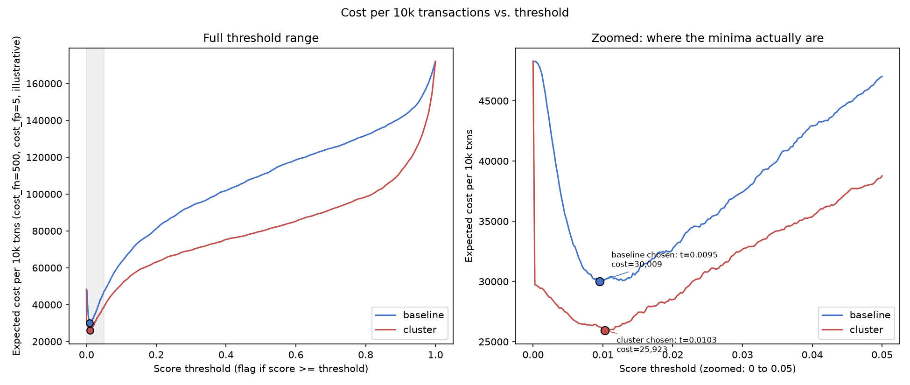
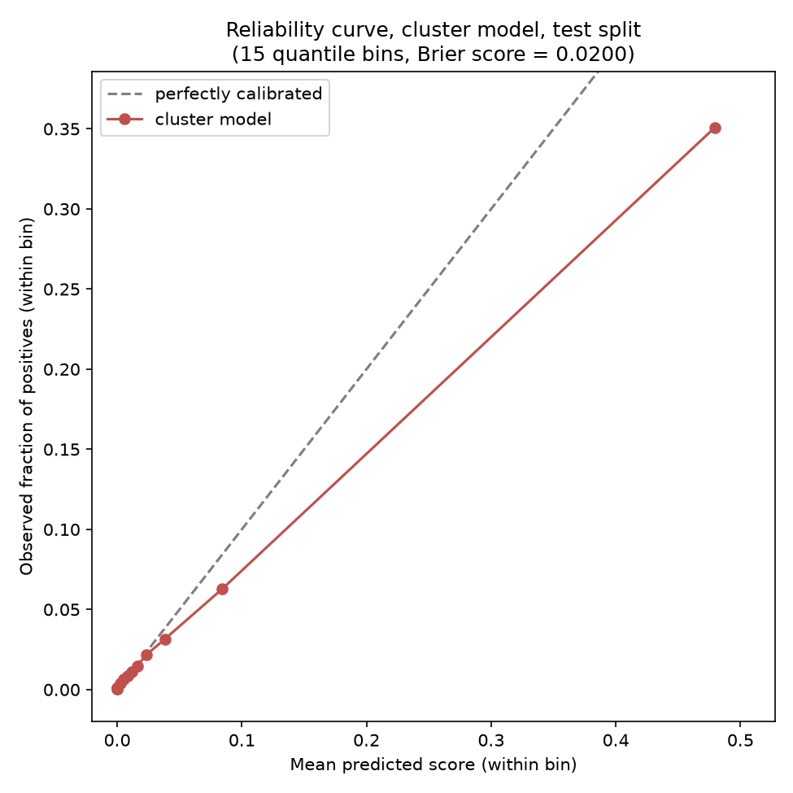

# Ablation: transaction-only baseline vs. cluster-augmented

Temporal split: 472,432 train rows, 118,108 test rows (as_of = TransactionDT 12,192,900, the first test-period timestamp).

Cost assumptions are illustrative, NOT Razorpay figures: cost_fn=500 (a missed abuse case), cost_fp=5 (a false alarm / unnecessary step-up) -- a 100:1 ratio, chosen to represent a chargeback loss being much costlier than customer friction, nothing more precise than that. The threshold used below (0.0099) is cost_fp/(cost_fn+cost_fp), the cost-minimizing point for a well-calibrated classifier under this cost ratio; results/cost_curve.png sweeps thresholds directly rather than relying on that calibration assumption.

## Results

| model | PR-AUC | Recall @ 1% FPR | Cost per 10k txns |
|---|---:|---:|---:|
| baseline | 0.5646 | 0.4791 | 30078.40 |
| cluster | 0.6322 | 0.5576 | 26155.72 |

Cluster model vs. baseline: PR-AUC +0.0676, recall@1%FPR +0.0785, cost per 10k -3922.68 (negative is better for cost). Reported as-is; the derivation and features were not adjusted after seeing these numbers.

**This +0.0676 figure is a single-split measurement and must be read alongside the cross-split range, never alone.** results/stability.md re-ran this same ablation (fresh graph, fresh causal cluster features, fresh models -- nothing cached) at 4 rolling temporal splits (60/70/80/90% through sorted TransactionDT). Full lift across those splits: mean **+0.0516**, spread **0.0393** -- directionally consistent (positive at every split), but the swing is a large fraction of the mean itself, so +0.0676 should be read as one sample from a noisy range, not a fixed number. Residual lift with `cluster_prior_fraud_share` removed (the 0.5756-PR-AUC row in section 3 below is this same measurement, on this one split): mean **+0.0060**, spread **0.0230**, and it **changes sign** across splits (negative at 60% and 90%, positive at 70% and 80%). Corrected, not softened: the structural/graph features on their own (edge density, velocity, burst concentration, email heterogeneity, cluster size) do not show a reliable lift on this dataset at this sample size. See results/stability.md for the full per-split table.

## Detailed findings

*(Moved here from README.md's Result section during a README restructure, verbatim except for cross-references that pointed back into README -- nothing below is a new claim.)*

About 84% of the headline PR-AUC lift (+0.0676) comes from a single feature, `cluster_prior_fraud_share` -- without it, the lift is +0.0110 PR-AUC (0.5756 vs. 0.5646) on this split. That feature was traced end to end and confirmed not to leak test-period labels (checked against all 155,579 clusters, not spot-checked -- see this report's Sanity checks section above), but its predictive power leans heavily on this dataset's label-propagation dynamic (a chargeback on one transaction retroactively marks the rest of that card's history as fraud), not on an independently-discovered abuse signal. See README.md's Limitations section.

**The +0.0676 figure is a single split; it should never be read alone.** Re-running the full ablation at 4 rolling temporal splits (60/70/80/90% through sorted `TransactionDT` -- see [results/stability.md](stability.md)) gives: full lift **mean +0.0516 across the 4 splits, spread 0.0393** -- directionally consistent (positive at every split) and larger than the single 0.68-point figure by itself would suggest is stable, but with real swing. **Correction, not a softening:** this project previously described the residual lift once `cluster_prior_fraud_share` is removed as "a smaller but genuine residual lift" from the remaining structural/graph features (edge density, velocity, burst concentration, email heterogeneity, cluster size). That claim does not hold up. Across the same 4 splits, the residual lift is **mean +0.0060, spread 0.0230, and changes sign** (negative at 60% and 90%, positive at 70% and 80%). Graph-structure features alone do not show a reliable lift on this dataset at this sample size -- only `cluster_prior_fraud_share` shows a consistently positive effect across splits, and per README.md's Limitations note, that effect is itself partly circular. Full per-split numbers are in [results/stability.md](stability.md).

**The dominant feature is backward-looking, partly circular fraud history, stated plainly.** `cluster_prior_fraud_share` is backward-looking fraud history, not a forward-looking abuse signal -- it is powerful but partly circular in a chargeback-labelled dataset, because it partly measures label propagation across a card rather than independently discovering coordinated abuse. Labels are chargeback-reported and, per how this dataset is constructed, propagate across a card once one transaction on it is reported -- a single confirmed chargeback can retroactively paint every other transaction on that card as fraud, whether or not each one actually was. `cluster_prior_fraud_share`, the single largest driver of the measured lift, is close to a direct measurement of this same propagation dynamic ("has this persistent card-identity already been caught"). That makes it a legitimate, non-leaking feature, not an independently-discovered abuse signal -- the model is partly learning to reproduce the label-generation process itself. This matters more than it looks: the residual-lift finding above (from results/stability.md) shows the *other* cluster features (everything left once `cluster_prior_fraud_share` is removed) do not show a reliable lift across rolling temporal splits at all -- so this one backward-looking, partly-circular feature is carrying essentially all of the reliably measured lift, not just the largest share of it.

## Hyperparameters (identical for both models)

```
objective: binary
metric: None
verbosity: -1
seed: 42
num_leaves: 63
learning_rate: 0.05
feature_fraction: 0.8
bagging_fraction: 0.8
bagging_freq: 1
min_data_in_leaf: 50
num_boost_round: 300
```

Baseline features: 432. Cluster features add: 10 columns (the graph.compute_cluster_features output -- cluster size/txn count/edge density/velocity/amount CV/burst concentration/email-uid ratio/prior-fraud share, plus per-uid node degree and email domain count).

## Cluster model feature importances (top 20 by gain)

| feature | gain |
|---|---:|
| cluster_prior_fraud_share | 558,334.3 |
| V258 | 63,550.3 |
| C1 | 52,819.7 |
| DeviceInfo | 28,908.5 |
| C14 | 27,892.7 |
| cluster_size_uids | 27,155.8 |
| uid_email_domain_count | 15,768.0 |
| C13 | 14,856.7 |
| cluster_amt_cv | 13,615.7 |
| card2 | 10,830.0 |
| TransactionDT | 9,482.1 |
| TransactionAmt | 9,441.0 |
| V156 | 8,742.6 |
| id_31 | 8,726.3 |
| D2 | 8,573.2 |
| C7 | 7,891.9 |
| cluster_txn_count | 7,771.6 |
| cluster_velocity | 7,521.8 |
| C11 | 7,514.6 |
| P_emaildomain | 6,932.8 |

## Graph construction

max_degree=20 (see graph.py's module docstring for why the function's own default of 1000 is unusable on this dataset -- it collapses 64% of all uids into one connected component).
Built from 472,432 train-period transactions: 167,111 nodes, 62,804 edges.

Hub guard excluded 1114 values (covering 376,264 uid-appearances in total, with overlap across rules) as too common to be evidence of a relationship. Ten largest:

| rule | value | uid_count |
|---|---|---:|
| device_info | Windows | 18,535 |
| device_info | iOS Device | 12,719 |
| device_info | MacOS | 8,344 |
| card_bank_addr | (150.0, 226.0, 299.0) | 6,545 |
| addr1_email | (299.0, 'gmail.com') | 6,414 |
| card_bank_addr | (150.0, 226.0, 204.0) | 5,824 |
| addr1_email | (264.0, 'gmail.com') | 5,548 |
| addr1_email | (204.0, 'gmail.com') | 5,471 |
| addr1_email | (325.0, 'gmail.com') | 5,434 |
| card_bank_addr | (150.0, 226.0, 325.0) | 5,145 |

## Sanity checks

### 1. Correlation of cluster features with isFraud (train set)

Computed over the 472,432 train rows; each feature's correlation uses only the rows where that feature is non-null (pandas' default pairwise behavior) -- n_valid shows how many that was per feature.

| feature | correlation with isFraud | n_valid |
|---|---:|---:|
| cluster_prior_fraud_share | 0.7797 **(>0.5)** | 417,872 |
| cluster_velocity | 0.0573 | 417,872 |
| cluster_edge_density | -0.0469 | 30,436 |
| cluster_txn_count | 0.0327 | 417,872 |
| cluster_burst_concentration | -0.0311 | 417,872 |
| cluster_size_uids | 0.0309 | 417,872 |
| node_degree | 0.0230 | 417,872 |
| cluster_email_uid_ratio | -0.0077 | 417,872 |
| cluster_amt_cv | -0.0038 | 328,202 |
| uid_email_domain_count | -0.0013 | 417,872 |

**1 feature(s) exceed the 0.5 red-flag threshold: cluster_prior_fraud_share (0.780).** Investigated in section 2.

### 2. Tracing cluster_prior_fraud_share for a leak

cluster_prior_fraud_share is computed inside graph.compute_cluster_features as: for every transaction with `TransactionDT < as_of`, take the per-uid max of isFraud over *that uid's own* qualifying transactions (`by_uid["isFraud"].max()`), then average that per-uid flag across the uids in each cluster. The `as_of` filter is applied to `transactions` before any of this runs -- there is no code path in compute_cluster_features that reads isFraud from a row that didn't pass the `TransactionDT < as_of` filter. That's the argument from reading the code (and it's what tests/test_graph.py's explicit leakage test already checks structurally). Below is the argument from the actual data instead.

Checked all 155,579 clusters that have both a reported cluster_prior_fraud_share and an independently-recomputable pre-as_of value: comparing the pipeline's reported value against one computed straight from raw rows with `TransactionDT < as_of`, bypassing graph.py entirely. Mismatches: **0**.

Concrete example -- the cluster where leaking would change this feature the most: cluster #17894, 1 member uids.

Its 2 fraud-labeled transaction(s) (all other member rows are isFraud=0, omitted for brevity):

| uid | TransactionDT | period | isFraud |
|---|---:|---|---:|
| 2616_123_-36 | 14,916,239 | test | 1 |
| 2616_123_-36 | 15,255,382 | test | 1 |

- Reported by the pipeline (as_of-filtered): **0.0000**
- Independently recomputed from raw rows with `TransactionDT < as_of`, bypassing graph.py entirely: **0.0000**
- What it would be if test-period rows leaked in (all-time max isFraud per member, no as_of filter): **1.0000**

**Reported value matches the independently-recomputed pre-as_of-only value, and differs from the would-leak value for this cluster -- confirmed on real data, not just in the unit test: no test-period fraud label influenced this cluster's prior-fraud feature.**

### 3. Ablation re-run with cluster_prior_fraud_share removed

Same training path (train_cluster_model, identical hyperparameters and seed), same cluster feature set minus this one column.

| model | PR-AUC | Recall @ 1% FPR | Cost per 10k txns |
|---|---:|---:|---:|
| cluster (no cluster_prior_fraud_share) | 0.5756 | 0.4951 | 29317.66 |

**This 0.5756 is the same single split as everything else in this report.** results/stability.md repeated this exact re-ablation (no `cluster_prior_fraud_share`) at 4 rolling temporal splits and found the resulting lift over baseline is mean +0.0060, spread 0.0230, changing sign across splits (negative at 60%/90%, positive at 70%/80% -- this row's split). Read in isolation, 0.5756 vs. 0.5646 looks like a small, genuine, consistently positive residual effect; across splits it isn't reliably positive at all. See results/stability.md and README.md's Result section for the full correction.

### 4. Cluster assignment for a test-period transaction never depends on test-period edges

Structurally: `graph.build_entity_graph` is called in run_pipeline.load_and_prepare with `train_df` only -- `test_df` is never passed to it, so no test-period transaction can ever contribute an edge or a node. Verified concretely below rather than just re-reading the call site.

- Every node in the graph corresponds to a uid with at least one train-period transaction: 0 nodes found in the graph with zero train-period transactions (should be 0).
- Concrete example: uid `10004_225_152` appears ONLY in the test period (no train-period transactions). It is absent from the graph's node set, and its broadcast cluster features are all null (as expected -- no train-period history means no cluster signal, not a fabricated one).

## Threshold sweep and cost curve

results/cost_curve.png sweeps score thresholds directly (not relying on the calibration assumption behind ablation.md's headline threshold) and marks each model's own cost-minimizing point.



| model | chosen threshold | cost per 10k at chosen point | recall | FPR |
|---|---:|---:|---:|---:|
| baseline | 0.0095 | 30008.97 | 0.9326 | 0.3813 |
| cluster | 0.0103 | 25923.31 | 0.9530 | 0.3695 |

Worth being explicit about: the cost-minimizing FPR here is 37%-38% -- a direct, correct mathematical consequence of the assumed 100:1 cost_fn:cost_fp ratio (missing fraud is assumed to be that much worse than a false alarm, so the optimum flags aggressively), not a bug. In practice this means stepping up upwards of a third of all legitimate transactions at the "optimal" point -- whether that's acceptable is a business call the assumed cost ratio drives entirely; a less aggressive cost ratio (or a friction budget constraint) would move the chosen threshold and the resulting FPR substantially.

## Calibration

results/calibration.png -- reliability curve for the cluster model on the test split (quantile-binned, since scores concentrate near 0 at this base rate; equal-width bins would put almost everything in one bin).



- Brier score: **0.0200** (lower is better; a model that always
  predicts the test-set base rate 0.0344 scores 0.0332 for comparison)
- Mean absolute gap between observed and predicted fraction, equally weighted across the 15 bins: **0.0111** -- this number is misleading on its own, see below.
- Highest-score bin (mean predicted score 0.4795, the bin nearest where policy.py's thresholds actually operate): observed fraction of positives is **0.3509**, a gap of **-0.1286**.

**The equally-weighted average is misleading here and would say the wrong thing if reported alone.** Most of the 15 bins sit at very low predicted scores, where a ~3.5%-base-rate model is naturally easy to calibrate (predicting near 0 for mostly-0 outcomes), so they pull the average down. The bin that actually matters for policy.py -- the highest one, mean predicted score 0.4795, which is above both STEP_UP_THRESHOLD (0.0103) and REVIEW_THRESHOLD (0.1843) -- is **overconfident by 0.13** (predicts ~0.48, actual positive rate is only 0.35).

**Verdict: not well calibrated in the region the policy engine actually operates in, despite a low overall Brier score.** policy.py's REVIEW_THRESHOLD (0.1843) should be read as an arbitrary cut on this model's score scale, not as "we estimate >18.43% abuse risk" -- scores in this upper range systematically overstate the true positive rate. The fix, if a true probability is needed, is isotonic or Platt scaling fit on a held-out calibration slice -- **not implemented here**: model.py is frozen this session, and refitting a calibration map changes how scores are produced, which is not something to add quietly under a task that explicitly said do not retrain the model.

