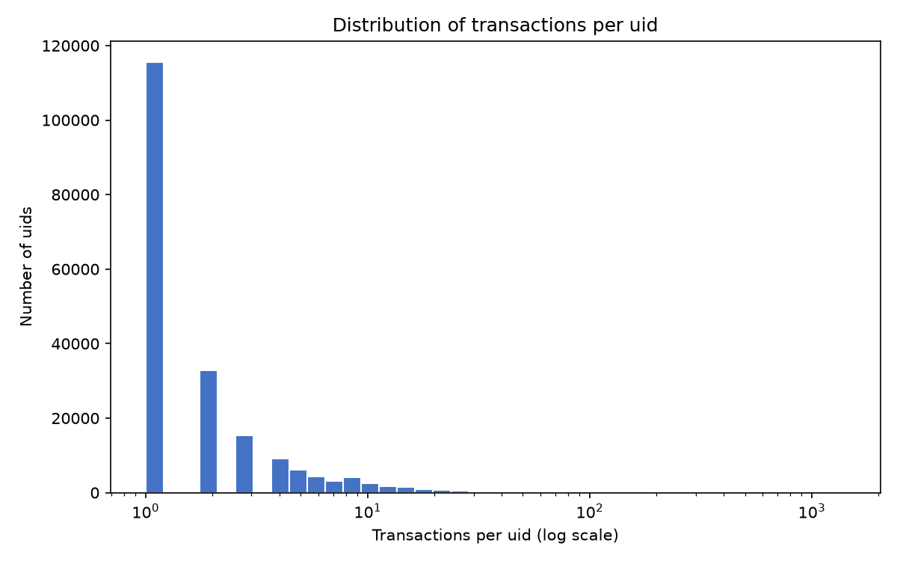

# uid validation report

Computed on the real IEEE-CIS `train_transaction.csv` (590,540 rows) by `scripts/validate_uids.py`, using the `card1_addr1_origin_day` uid derivation in `src/entities.py`. Numbers are reported as-is; the derivation was not adjusted to improve any of them.

## 1. Valid uid vs NaN, by cause

- Total transactions: **590,540**
- Valid uid: **523,746** (88.69%) -- NaN uid: **66,794** (11.31%)
- NaN breakdown by cause (mutually exclusive):
  - D1 null only: 1,088
  - addr1 null only: 65,525
  - Both D1 and addr1 null: 181
  - card1 null (any row): 0 -- confirms the assumption that card1 is always present in this file
- Each of these three counts means: that many transactions have no usable value for the named field(s), so no uid could be formed for them and they were left as NaN rather than guessed at.

## 2. Transactions per uid

- Distinct uids: **199,070**
- Singleton share (uids with exactly 1 transaction): **58.03%**
- Median transactions per uid: **1**
- 90th percentile: **6**
- Max: **1,414**
- This describes how concentrated activity is across resolved identities: a high singleton share means most uids see only one transaction, while the max/p90 show how large the biggest collapsed identities get.

## 3. Label purity (the key number)

- uids with 2+ transactions: **83,557**
- Label-pure fraction, unweighted (isFraud uniform across all rows of the uid): **98.53%**
- Label-pure fraction, weighted by transaction count: **97.61%**
- The unweighted number treats every multi-transaction uid equally regardless of size; the weighted number reflects what fraction of *transactions* (not uids) sit inside a label-pure cluster -- if it differs a lot from the unweighted figure, purity depends on cluster size.

## 4. Ten largest impure uids

| uid | size | fraud_rate |
|---|---:|---:|
| 12695_325_-342 | 123 | 73.17% |
| 9500_330_17 | 83 | 90.36% |
| 12839_264_40 | 59 | 1.69% |
| 16998_330_-37 | 58 | 5.17% |
| 12839_264_36 | 58 | 1.72% |
| 17188_299_61 | 53 | 43.40% |
| 9500_272_-10 | 49 | 34.69% |
| 17188_299_82 | 45 | 2.22% |
| 5287_512_39 | 45 | 97.78% |
| 7664_264_-58 | 43 | 4.65% |

- `size` is the uid's total transaction count; `fraud_rate` is the share of that uid's transactions labeled isFraud=1. A uid appears here because its rows do NOT all share the same label.

## 5. Fraud rate: uid'd rows vs NaN rows

- Fraud rate among rows with a valid uid: **2.46%**
- Fraud rate among rows with a NaN uid: **11.63%**
- If these two rates differ substantially, the transactions that fail to get a uid are not a random sample of traffic -- the null handling would be systematically excluding a different-risk slice of transactions from entity-level features, which matters for how much to trust cluster-based signals downstream.

## Histogram

